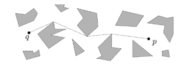
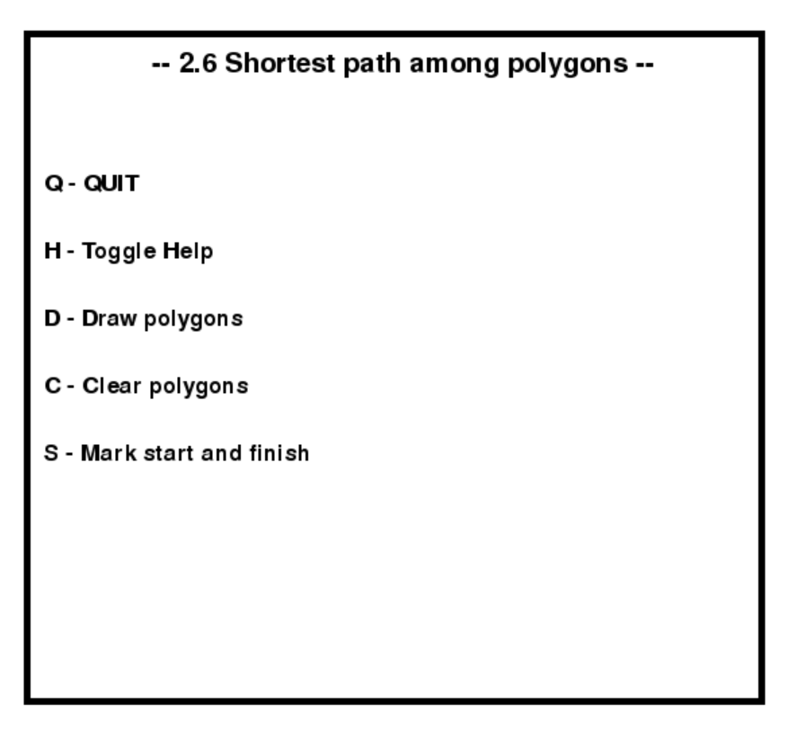
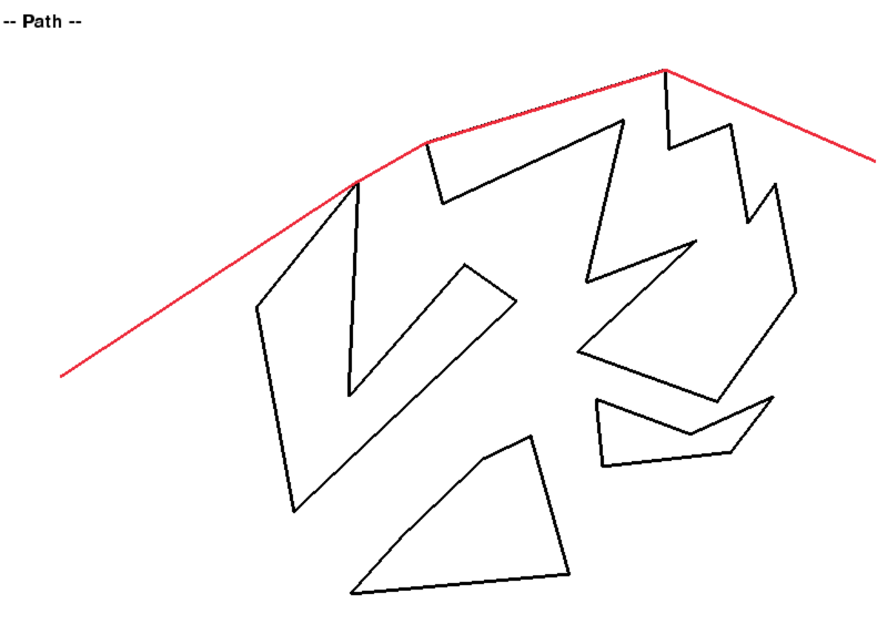

## Shortest path among polygons
Solution for Geometric Algorithms course project from Faculty of Computer Science. Detailed problem statement and proposed solution can be found in the book [Computational Geometry - Algorithms and Application](https://people.inf.elte.hu/fekete/algoritmusok_msc/terinfo_geom/konyvek/Computational%20Geometry%20-%20Algorithms%20and%20Applications,%203rd%20Ed.pdf) chapter 15.
## Problem statement
Write a program that, that, given a set of disjoint polygons, a start point p, and an endpoint q, computes the shortest path between p and q  that does not enter into the interior of any polygon. 

**Upper bounds: O(n^2log n) time, where n is the total number of edges in the obstacles.**




## Getting started

Since this project uses a lot of libraries I recommend using *requirements.txt*. 
Run the following commands to clone the repo, install all the requirements and run the example. 

``` bash
git clone https://github.com/mmilunovic/Shortest-path-among-polygons.git
cd Shortest-path-among-polygons
pip install -r requirements.txt
python 2.6.py
```

When you run it you'll be faced with starting window that explains  basic commands like *Draw, Clear, Start path...*
Press **H** to hide it and enter drawing mode.



Use left mouse click to define the edges of the polygon, and the right click to automatically finish the polygon.


Once you've finished your polygons switch to *Path* mode by pressing **S**
Use the left click to define the start and right click to define the end. Once you've done both the red line representing the path will show up.

You can also drag the mouse while holding the right click to see the path change. 




